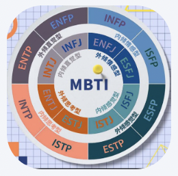
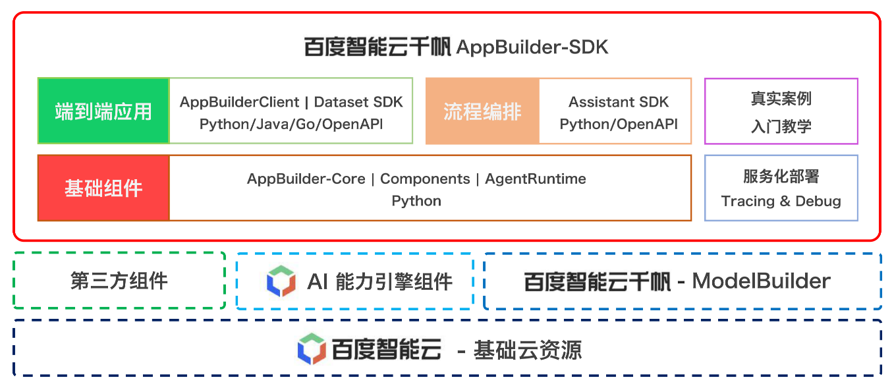

<div align="center">

<br>

[](LICENSE)


</div>

简体中文 | [English](./README_en.md)

<br>


## 什么是AppBuilder-SDK

百度智能云千帆AppBuilder-SDK是[百度智能云千帆AppBuilder](https://appbuilder.cloud.baidu.com/)面向AI原生应用开发者提供的一站式开发平台的客户端SDK。

我们提供自底向上的：基础组件、流程编排、端到端应用 三类功能。使用百度智能云千帆AppBuilder-SDK，你可以：

- 配合百度智能云千帆AppBuilder平台[网页端](https://console.bce.baidu.com/ai_apaas/app)，分钟级在本地搭建包含百度工业实践的`端到端的AI原生应用`
- 配合 `基础组件` & `流程编排`，积木式搭建个性化的Assistant + FunctionCall应用
- 提供 `API调用` & `交互式窗口` 两种服务化部署方式，支持快速上云，平滑嵌入到你的产品中


##  如何安装

#### 百度智能云千帆AppBuilder-SDK 最新版本 0.9.0 (2024-06-28)

百度智能云千帆AppBuilder-SDK 更新记录&最新特性请查阅我们的[版本说明](/docs/quick_start/changelog.md)

- `Python`版本安装，要求Python版本 >= `3.9`

```bash
python3 -m pip install --upgrade appbuilder-sdk
```
- `Java` 及 `Go` 版本安装，以及通过`Docker`镜像使用，请查阅[安装说明](/docs/quick_start/install.md)


## 快速开始你的第一个AI原生应用

- 请在`>=3.9`的Python环境安装`appbuilder-sdk`后使用该端到端应用示例
- 示例中提供了试用Token，访问和QPS受限，正式使用请替换为您的个人Token
- 示例中的应用为：[地理小达人](https://appbuilder.baidu.com/s/x1tSF)，点击该连接在网页端试用

#### 代码示例

```python
import appbuilder
import os

# 设置环境中的TOKEN，以下TOKEN为访问和QPS受限的试用TOKEN，正式使用请替换为您的个人TOKEN
os.environ["APPBUILDER_TOKEN"] = "bce-v3/ALTAK-n5AYUIUJMarF7F7iFXVeK/1bf65eed7c8c7efef9b11388524fa1087f90ea58"

# 从AppBuilder网页获取并传入应用ID，以下为地理小达人应用ID
app_id = "42eb211a-14b9-43d2-9fae-193c8760ef26"

app_builder_client = appbuilder.AppBuilderClient(app_id)
conversation_id = app_builder_client.create_conversation()

answer = app_builder_client.run(conversation_id, "中国的首都在哪里？春季天气怎么样？有什么适合玩的景点？")
print(answer.content)
```

#### 回答展示

> 中国的首都是**北京**^[2]^。
> 
> 春季的北京天气多变，早晚温差较大，出门还是要多带件外套。但是，这个季节是北京逛公园的好季节，玉兰花、桃花与迎春花等花卉盛开，为北京的春天增添了美丽的色彩^[1]^。
> 
> 适合玩的景点有：
> 1. **天坛公园**。天坛公园是明清两代的皇家祭祀场所，也是世界上现存规模最大的古代祭祀建筑群。
> 2. **故宫博物院**。故宫是中国古代建筑和文化的重要遗产，也是北京的一大旅游景点。
> 3. **长城**。长城是中国古代的一项伟大工程，也是北京周边的重要景点。
> 4. **颐和园**。颐和园是中国古代皇家园林，也是北京的一大旅游景点^[1]^。


#### 更多代码示例

更多AI原生应用示例代码，请浏览 [CookBooks](./cookbooks/README.md)，我们有以下cookbook推荐您优先阅读：

| 应用类型 |应用链接 | 推荐理由 |
|--|--|--|
| 基础能力组件 | [通用文字识别](/cookbooks/components/general_ocr.ipynb) | 体验百度AI开放平台提供的通用文字识别-高精度版的精准识别结果 |
| 基础能力组件 | [基础组件服务化](/cookbooks/components/agent_runtime.ipynb) | 基础组件可通过flask实现服务化部署 或 通过chainlit实现可交互的前端部署，集成到您的系统中 |
| 流程编排 |  [Assistant SDK](/cookbooks/pipeline/assistant_function_call.ipynb) | 学习如何纯代码态搭建一个Agent应用，并实现自定义工作流程及FunctionCall |
| 端到端应用 |  [AppBuilder Client SDK](/cookbooks/agent_builder.ipynb) | 使用AppBuilder网页端创建并发布一个Agent应用后，通过AppBuilderClient SDK集成到你的系统中 |
| 端到端应用 |  [简历筛选小助手](/cookbooks/end2end_application/rag/rag.ipynb) | 通过对本地简历库的简历进行解析、切片、创建索引，实现基于JD进行简历筛选，并对筛选的Top1简历进行总结 |
| 端到端应用 |  [企业级问答系统](/cookbooks/end2end_application/rag/qa_system_2_dialogue.ipynb) | 学习如何通过SDK与网页平台搭配，实现离线知识库生产与在线问答 |

#### 更多应用示例

更多AI原生应用示例，请浏览 [AppBuilder 应用广场](https://console.bce.baidu.com/ai_apaas/appCenter) ，我们有以下热门应用推荐您优先尝试：

| 应用Icon  | 应用链接 | 推荐理由 |
|--|:--| :--|
|  |  [MBTI人格测试](https://console.bce.baidu.com/ai_apaas/examplePage/6f6f1fb4-c03c-4ef4-8bb2-e2a06732786d)| 5道题揭秘你的MBTI人格类型，快来测试吧！|
|  |  [论文帮手](https://console.bce.baidu.com/ai_apaas/examplePage/62a84f93-c8e0-4aad-b2e7-bb97893387b7)| 提供方向与关键词，我能为你推荐相关论文、提供论文的框架模板，并根据推荐的论文撰写综述。|
|  |  [汽车专家](https://console.bce.baidu.com/ai_apaas/examplePage/7f7e8c41-057d-4e5b-85de-2137ba03b982)| 为你提供各种汽车相关的信息，包括品牌、型号、配置、价格等方面的信息。|
|  |   [旅行规划专家](https://console.bce.baidu.com/ai_apaas/examplePage/af495e21-505f-48be-911b-f8b7450c5f71)| 无论你是想探索未知的远方，还是寻找身边的美丽风景，我都会为你提供贴心的旅行建议和信息。|
|  |  [爱因斯坦](https://console.bce.baidu.com/ai_apaas/examplePage/1058ade8-a030-406b-bdf3-674aabd5bdf8)| 你好，我是爱因斯坦，让我们一起探索奇妙的科学世界吧！|

## 百度智能云千帆AppBuilder-SDK 能力全景图
<div align="center">

</div>


## 用户文档

- [快速开始](/docs/quick_start/README.md)
    - [安装说明](/docs/quick_start/install.md)
    - [版本说明](/docs/quick_start/changelog.md)
- [基础功能](/docs/basic_module/README.md)
    - [基础能力组件](/docs/basic_module/components.md)
    - [流程编排](/docs/basic_module/assistant_sdk.md)
    - [端到端应用](/docs/basic_module/appbuilder_client.md)
- [进阶实践](/docs/advanced_application/README.md)
    - [CookBooks](/cookbooks/README.md)
- [服务化部署](/docs/service/README.md)
    - [API调用](/docs/service/flask.md)
    - [交互式前端](/docs/service/chainlit.md)
    - [公有云部署](/docs/service/cloud.md)
- [二次开发](/docs/develop_guide/README.md)


## 开源社区与活动
<div align="center">
<h3>百度智能云千帆AppBuilder-SDK微信交流群</h3>

</div>

- [Github Issue](https://github.com/baidubce/app-builder/issues):  提交安装/使用问题、报告bug、建议新特性、沟通开发计划等

- [百度智能云千帆社区](https://cloud.baidu.com/qianfandev)：
    - [千帆杯新手训练营 - 多类型主题练习赛](https://cloud.baidu.com/qianfandev/aimatch)
    - [千帆杯AI原生应用创意挑战赛 - 教育生态行业赛](https://cloud.baidu.com/qianfandev/topic/269711)
    - [千帆杯AI原生应用创意挑战赛 - 效率工具常规赛](https://cloud.baidu.com/qianfandev/topic/269599)


## License

AppBuilder-SDK遵循Apache-2.0开源协议。

