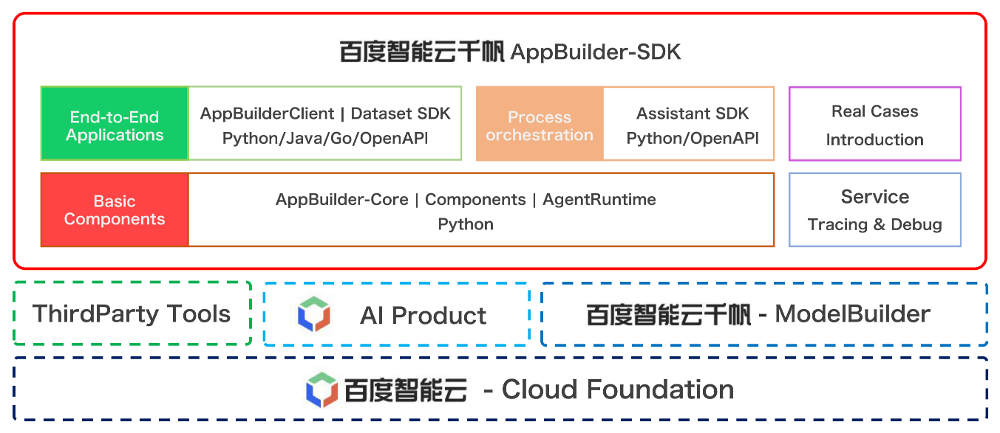

<div align="center">

<br>

[](LICENSE)


</div>

[简体中文](./README.md) | English

<br>


## What is AppBuilder SDK?

Baidu AI Cloud Qianfan AppBuilder SDK is a `one-stop development tool` for AI native application developers which contributed by [Baidu AI Cloud Qianfan AppBuilder](https://appbuilder.cloud.baidu.com/).


We provide three types of functions from bottom to top: basic components, process orchestration, and end-to-end applications. With Baidu AI Cloud Qianfan AppBuilder SDK, you can:

- Cooperate with Baidu AI Cloud Qianfan AppBuilder platform [web side](https://console.bce.baidu.com/ai_apaas/app), Build an end-to-end AI native application that includes Baidu's industrial practices at the minute level: Agent / RAG / Workflow application

- Collaborate with basic components and process orchestration to build personalized `Assistant` + `FunctionCall` applications in a modular manner

- Provide two service-oriented deployment methods: API calls and interactive windows, supporting fast cloud deployment


##  How to install？

#### The latest version of Baidu AI Cloud Qianfan AppBuilder SDK is 0.9.0 (2024-06-28)

Baidu AI Cloud Qianfan AppBuilder SDK ReleaseNote please refer to our [version description](/docs/quick_start/changelog.md)

- We recommend installing the latest stable version of `Python`

```bash
python3 -m pip install --upgrade appbuilder-sdk
```
- For installation of `Java` and `Go` versions, as well as using `Docker` images, please refer to the [Installation Instructions](/docs/quick_start/install.md)


## Quickly start your first AI native application!

- Please install `appbuilder sdk` in a Python environment with `>=3.9` and use this end-to-end application example
- The example provides a trial token, but access and QPS are restricted. Please replace it with your personal token for official use
- The application in the example is: [Geography expert](https://appbuilder.baidu.com/s/x1tSF), Click on the link to try it out on the web page

#### Code example

```python
import appbuilder
import os

# Set the TOKENs in the environment. The following TOKENs are trial TOKENs with restricted access and QPS. Please replace them with your personal TOKENs for official use
os.environ["APPBUILDER_TOKEN"] = "bce-v3/ALTAK-n5AYUIUJMarF7F7iFXVeK/1bf65eed7c8c7efef9b11388524fa1087f90ea58"

# Obtain and pass in the application ID from the AppBuilder webpage. The following is the application ID of the Geography Expert
app_id = "42eb211a-14b9-43d2-9fae-193c8760ef26"

app_builder_client = appbuilder.AppBuilderClient(app_id)
conversation_id = app_builder_client.create_conversation()

answer = app_builder_client.run(conversation_id, "Where is the capital of the United States and what is the climate like? answer by english")
print(answer.content)
```

#### Answer display

> The capital of the United States is **Washington, D.C.**^[1]^. 
> 
> The climate of Washington, D.C. is generally mild and wet, with hot summers and cold winters. The city experiences a high level of rainfall, especially in the spring and summer months. However, it also has a high level of sunshine and warm weather in the summer months.^[2]^


**For more examples of AI native application code, please refer to [CookBooks](./bookbooks/README.md)**. We have the following cookbooks that we recommend you to read first:
- Basic Ability Components
    - [General Text Recognition Component](/cookbooks/components/general_ocr.ipynb)
    - [Basic component service-oriented deployment](/cookbooks/components/agent_runtime.ipynb)
- Process orchestration
    - [Assistant SDK](/cookbooks/pipeline/assistant_function_call.ipynb)
- End-to-end applications
    - [Agent](/cookbooks/agent_builder.ipynb)
    - [RAG](/cookbooks/end2end_application/rag/rag.ipynb)
    - [Enterprise level Q&A system](/cookbooks/end2end_application/rag/qa_system_2_dialogue.ipynb)


## Panorama of Baidu AI Cloud Qianfan AppBuilder SDK capability
<div align="center">

</div>


## User Documentation

- [Quick start](/docs/quick_start/README.md)
    - [Installation instructions](/docs/quick_start/install.md)
    - [Release note](/docs/quick_start/changelog.md)
- [Basic components](/docs/basic_module/README.md)
    - [Basic Ability Components](/docs/basic_module/components.md)
    - [Process orchestration](/docs/basic_module/assistant_sdk.md)
    - [End-to-end applications](/docs/basic_module/appbuilder_client.md)
- [Advanced Practice](/docs/advanced_application/README.md)
    - [CookBooks](/cookbooks/README.md)
- [Service deployment](/docs/service/README.md)
    - [API calls](/docs/service/flask.md)
    - [Interactive front-end](/docs/service/chainlit.md)
    - [Cloud deployment](/docs/service/cloud.md)
- [Secondary development](/docs/develop_guide/README.md)


## Open source community and activities
<div align="center">
<h3>AppBuilder-SDK WeChat Group QR Code</h3>

</div>

- [Github Issue](https://github.com/baidubce/app-builder/issues):  Submit installation/usage issues, report bugs, suggest new features, communicate development plans, etc

- [Baidu AI Cloud Qianfan Community](https://cloud.baidu.com/qianfandev)


## License

AppBuilder SDK follows the Apache 2.0 open source protocol.

