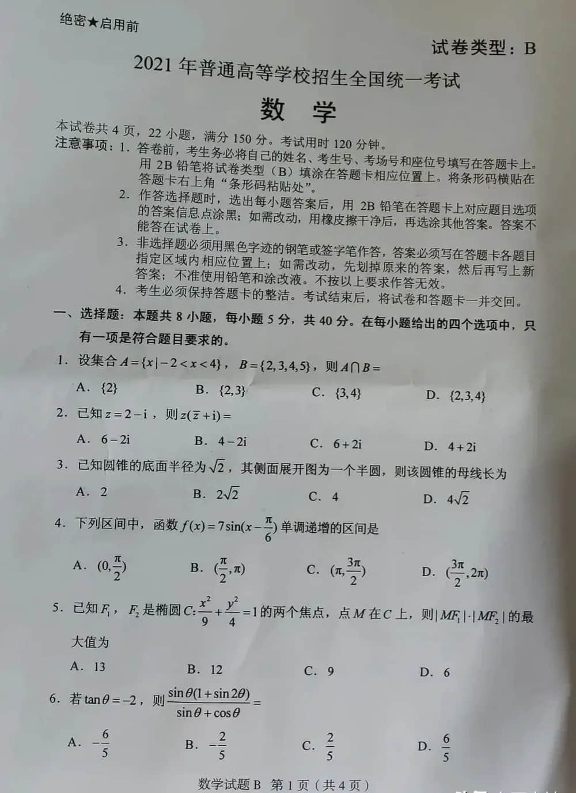

# 文档矫正增强 (DocCropEnhance) 

## 简介
文档矫正增强 (DocCropEnhance) 可对图片中的文件、卡证、票据等内容进行四角点检测定位，提取主体内容并对其进行矫正，同时可选图片增强效果进一步提升图片清晰度，达到主体检测矫正并增强的目的，提升图片整体质量
### 功能介绍
* 文档矫正增强

  支持对文档中的文件、卡证等内容进行主体检测与矫正，同时可开启增强功能
### 特色优势
* 技术领先

  模型针对图片倾斜、弯曲等情况进行专项优化，鲁棒性强，在处理图像的同时，可完整保留原有文档内容
* 能力丰富
  
  提供文档图片矫正、增强、去手写等多项能力，全方位提升图像质量，适用于采集质量把控、文字识别效果提升等多应用场景
### 应用场景
   旨在改善文档图像质量，提升可读性和可处理性，广泛应用于图像处理和分析、归档和数字化等领域
## 基本用法

下面是文档矫正增强代码示例：

示例图片为



```python
import os
import appbuilder
import requests

# 请前往千帆AppBuilder官网创建密钥，流程详见：https://cloud.baidu.com/doc/AppBuilder/s/Olq6grrt6#1%E3%80%81%E5%88%9B%E5%BB%BA%E5%AF%86%E9%92%A5
os.environ["APPBUILDER_TOKEN"] = '...'

# 从BOS读取样例图片
image_url = "https://bj.bcebos.com/v1/appbuilder/doc_enhance_test.png?" \
            "authorization=bce-auth-v1%2FALTAKGa8m4qCUasgoljdEDAzLm%2F2024-01" \
            "-24T12%3A51%3A09Z%2F-1%2Fhost%2F2020d2433da471b40dafa933d557a1e" \
            "be8abf28df78010f865e45dfcd6dc3951"
raw_image = requests.get(image_url).content
# 创建文档矫正增强组件实例
doc_crop_enhance = appbuilder.DocCropEnhance()
# 执行操作并获取结果
out = doc_crop_enhance.run(appbuilder.Message(content={"raw_image": raw_image}),enhance_type=3)
print(out.content)
# {"image_processed": "...", 'points': [{'y': 1371, 'x': 0}, {'x': 0, 'y': 0}, {'x': 997, 'y': 0}, {'x': 994, 'y': 1371}]}
```


## 参数说明

### 鉴权说明
使用组件之前，请首先申请并设置鉴权参数，可参考[组件使用流程](https://cloud.baidu.com/doc/AppBuilder/s/Olq6grrt6#1%E3%80%81%E5%88%9B%E5%BB%BA%E5%AF%86%E9%92%A5)。
```python
# 设置环境中的TOKEN，以下示例略
os.environ["APPBUILDER_TOKEN"] = "bce-YOURTOKEN"
```

### 初始化参数
无

### 调用参数
| 参数名称         | 参数类型    | 是否必须 | 描述                                                                                                                          | 示例值                                            |
|--------------|---------|------|-----------------------------------------------------------------------------------------------------------------------------|------------------------------------------------|
| message      | String  | 是    | 输入的消息，用于模型的主要输入内容。这是一个必需的参数                                                                                                 | Message(content={"raw_image": b"待识别的图片字节流数据"}) |
| enhance_type | Integer | 否    | 选择是否开启图像增强功能，如开启可选择增强效果，可选值如下：enhance_type =0：默认值，不开启增强功能，enhance_type = 1：去阴影，enhance_type = 2：增强并锐化，enhance_type = 3：黑白滤镜 | 0                                              |
|timeout| Float   | 否    | HTTP超时时间,单位：秒               |1||
| retry        | Integer | 否    | HTTP重试次数                                                                                                                    | 3                                              |

### 响应参数
| 参数名称            | 参数类型    | 描述                                        | 示例值                                                                                     |
|-----------------|---------|-------------------------------------------|-----------------------------------------------------------------------------------------|
| image_processed | String  | 返回处理后的图片，base64编码                         | "..."                                                                                   |
| points          | Array[] | 检测到的图片内主体在原图中的四角点坐标 | [{ "x": 0, "y": 1371 },{ "x": 0, "y": 0 },{ "x": 997, "y": 0 },{ "x": 994, "y": 1371 }] |

### 响应示例
```json
{
  "image_processed": "...",
  "points": [
    { "x": 0, "y": 1371 },
    { "x": 0, "y": 0 },
    { "x": 997, "y": 0 },
    { "x": 994, "y": 1371 }
  ]
}
```

## 高级用法

目前该模块仅提供基础的文档矫正增强功能。


## 更新记录和贡献
* 文档矫正增强能力 (2024-01)