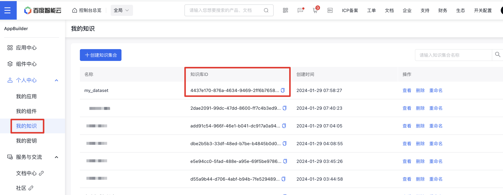

# 知识库组件（Dataset）

## 简介
知识库组件（Dataset）是对线上知识库操作的组件，可以通过SDK实现创建知识库、添加知识文档、查询知识库文档、删除知识文档等操作，可在平台console中查看结果。

### 功能介绍
对console端知识库进行操作，可以通过SDK实现创建知识库、添加知识文档、查询知识库文档、删除知识文档等操作，可在平台console中查看结果。

### 特色优势
和console端知识库操作一致，可实现快速创建、查询、删除等操作。

### 应用场景
通过SDK代码实现console端知识库操作。

## 基本用法
下面是示例代码，相应的操作结果可在平台console中查看，与console端同步
```python
import appbuilder
import os
import requests
# 请前往千帆AppBuilder官网创建密钥，流程详见：https://cloud.baidu.com/doc/AppBuilder/s/Olq6grrt6#1%E3%80%81%E5%88%9B%E5%BB%BA%E5%AF%86%E9%92%A5
# 设置环境变量
os.environ["APPBUILDER_TOKEN"] = "..."

# 初始化已有线上知识库，dataset_id 可在平台console中查看获取，详情可在下方初始化参数部分查看
dataset_id = "..."
dataset = appbuilder.console.Dataset(dataset_id)
# 或创建全新知识库
dataset = appbuilder.console.Dataset.create_dataset("my_dataset")

file_url = "https://agi-dev-platform-bos.bj.bcebos.com/ut_appbuilder/test.pdf?authorization=bce-auth-v1/e464e6f951124fdbb2410c590ef9ed2f/2024-01-25T12%3A56%3A15Z/-1/host/b54178fea9be115eafa2a8589aeadfcfaeba20d726f434f871741d4a6cb0c70d"
file_data = requests.get(file_url).content
file_path = "./test.pdf"  # 待解析的文件路径
with open(file_path, "wb") as f:
    f.write(file_data)

# 上传文档到知识库
file_paths = ["./test.pdf"]
document_infos = dataset.add_documents(file_paths)
print(document_infos)

# 获取第一页的文档列表, 每页10条
document_list = dataset.get_documents(1, 10)
print(document_list)

# 删除一个文档
document_ids = [document_infos.document_ids[0]]
dataset.delete_documents(document_ids)
```

## 参数说明

### 鉴权说明
使用组件之前，请首先申请并设置鉴权参数，可参考[使用流程](https://cloud.baidu.com/doc/AppBuilder/s/Olq6grrt6#1%E3%80%81%E5%88%9B%E5%BB%BA%E5%AF%86%E9%92%A5)。
```python
# 设置环境中的TOKEN，以下示例略
os.environ["APPBUILDER_TOKEN"] = "bce-YOURTOKEN"
```

### 初始化参数
- `dataset_id`: 线上已有知识库id，可在[console](https://console.bce.baidu.com/ai_apaas/dataset)上查看和获取，示例如图




### 创建知识库调用参数
| 参数名称         |参数类型 |是否必须 | 描述    |示例值|
|--------------|--------|--------|-------|------|
| dataset_name |String  |是 | 知识库的名字|"my_dataset"|
### 创建知识库响应参数
| 参数名称   | 参数类型    | 描述        | 示例值                                                                               |
|--------|---------|-----------|-----------------------------------------------------------------------------------|
| result | Dataset | dataset实例 | Dataset(dataset_id=2dae2091-99dc-47dd-8600-ff7c4b3ed93d, dataset_name=my_dataset) |
### 响应示例
```
Dataset(dataset_id=2dae2091-99dc-47dd-8600-ff7c4b3ed93d, dataset_name=my_dataset)
```

### 添加文档调用参数
| 参数名称         | 参数类型     | 是否必须 | 描述                                          | 示例值                                                                  |
|--------------|----------|------|---------------------------------------------|----------------------------------------------------------------------|
| file_paths     | List[String] | 是    | 文档路径列表                                      | ["./path1", "./path2"]                                               |
| is_custom_process_rule | bool     | 否    | 是否使用自定义文档处理策略                               | True                                                                 |
| custom_process_rule   | Dict     | 否    | 自定义文档处理策略，在is_custom_process_rule为True时需要设置 | {"separators":["。", "，"], "target_length": 300, "overlap_rate": 0.3} |
| is_enhanced           |   bool    | 否    | 是否开启知识增强                                    | False                                                                |

### 添加文档响应参数
| 参数名称   | 参数类型            | 描述       | 示例值                                                                                                                      |
|--------|-----------------|----------|--------------------------------------------------------------------------------------------------------------------------|
| result | AddDocumentsResponse | 添加文档响应信息 | AddDocumentsResponse(dataset_id='4437e170-876a-4634-9469-2ff6b76584e7' document_ids=['a279f3f2-e779-45c8-85ba-19f63c1c1316']) |
### 响应示例
```
AddDocumentsResponse(dataset_id='4437e170-876a-4634-9469-2ff6b76584e7' document_ids=['a279f3f2-e779-45c8-85ba-19f63c1c1316'])
```

### 获取文档列表调用参数
| 参数名称    | 参数类型   | 是否必须 | 描述    | 示例值  |
|---------|--------|------|-------|------|
| page    | int    | 是    | 页码，从1开始 | 1    |
| limit   | int    | 是    | 每页包含文档数量 | 10   |
| keyword | string | 否    | 关键词匹配 | "ai" |
### 获取文档列表响应参数
| 参数名称   | 参数类型 | 描述     | 示例值                    |
|--------|------|--------|------------------------|
| result | DocumentListResponse  | 文档列表对象 | DocumentListResponse(data=[FileInfo(id='a279f3f2-e779-45c8-85ba-19f63c1c1316', name='test.pdf', created_at=1706515108, indexing_status='parsing', error=None, enabled=True, disabled_at=None, disabled_by=None, display_status='处理中', word_count=0)], has_more=False, limit=10, total=1, page=1) |
```
DocumentListResponse(data=[FileInfo(id='a279f3f2-e779-45c8-85ba-19f63c1c1316', name='test.pdf', created_at=1706515108, indexing_status='parsing', error=None, enabled=True, disabled_at=None, disabled_by=None, display_status='处理中', word_count=0)], has_more=False, limit=10, total=1, page=1)
```

### 删除文档调用参数
| 参数名称         |参数类型 |是否必须 | 描述    | 示例值            |
|--------------|--------|--------|-------|----------------|
| document_ids |List[String]  |是 | 文档id列表| ["1234567890"] |
### 删除文档响应参数
无


## 高级用法
暂无


## 更新记录和贡献
* 平台console端知识库操作能力 (2024-01)
