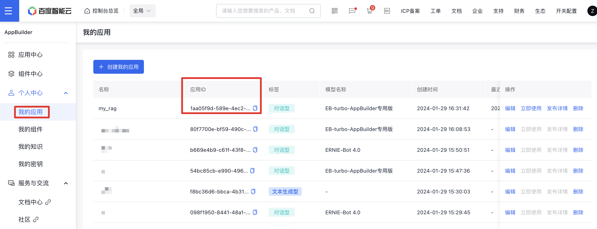

# console端RAG操作工具(RAG) 

## 简介
RAG是基于线上RAG应用的问答组件，可以使用该组件利用线上RAG应用进行问答。

### 功能介绍
利用线上RAG应用进行问答

### 特色优势
与线上应用联动，利用线上RAG应用进行问答

### 应用场景
使用SDK利用线上RAG应用进行问答

## 基本用法
以下是使用SDK进行问答的示例代码
```python
import appbuilder
import os
# 请前往千帆AppBuilder官网创建密钥，流程详见：https://cloud.baidu.com/doc/AppBuilder/s/Olq6grrt6#1%E3%80%81%E5%88%9B%E5%BB%BA%E5%AF%86%E9%92%A5
# 设置环境变量
os.environ["APPBUILDER_TOKEN"] = '...'

app_id = '...' # 线上RAG应用ID，可在console端查看
conversation_id = '...' # 会话ID，可选参数，不传默认新建会话
rag_app = appbuilder.console.RAG(app_id)
query = "中国的首都在哪里"
answer = rag_app.run(appbuilder.Message(query)) # 新建会话
print(answer.content) # 获取结果内容
conversation_id = answer.conversation_id # 获取会话ID，可用于下次会话
print(conversation_id)
query = "它有哪些旅游景点"
answer = rag_app.run(appbuilder.Message(query), conversation_id) # 接上次会话
print(answer.content) # 获取结果内容
print(answer.extra)  # 获取结果来源
```

## 参数说明
### 鉴权说明
使用组件之前，请首先申请并设置鉴权参数，可参考[组件使用流程](https://cloud.baidu.com/doc/AppBuilder/s/Olq6grrt6#1%E3%80%81%E5%88%9B%E5%BB%BA%E5%AF%86%E9%92%A5)。
```python
# 设置环境中的TOKEN，以下示例略
os.environ["APPBUILDER_TOKEN"] = "bce-YOURTOKEN"
```

### 初始化参数
- `app_id`: 线上RAG应用的ID，可在[console](https://console.bce.baidu.com/ai_apaas/app)上查看和获取，示例如图




### 调用参数 （以表格形式展示）
| 参数名称   | 参数类型    | 是否必须 | 描述             | 示例值                        |
|--------|---------|------|----------------|----------------------------|
| query  | Message | 是    | 提问的内容          | Message(content="北京的面积多大") |
| stream | bool    | 否    | 是否流式返回，默认False | False                      |
| conversation_id | string  | 否    | 不传默认新建会话       | ""                         |

### 响应参数
| 参数名称   | 参数类型       | 描述     | 示例值                                                                                                             |
|--------|------------|--------|-----------------------------------------------------------------------------------------------------------------|
| result | Message    | 返回结果   | Message(name=msg, content=北京市的面积是16410.54平方公里^[2]^。, mtype=dict, extra={'search_baidu': [{'id': '1', 'content': '北京,简称“京”,是中华人民共和国的首都,是全国的政治中心、文化中心,是世界著名古都和现代化国际...', 'type': 'web', 'from': 'search_baidu', 'title': '北京概况_首都之窗_北京市人民政府门户网站', 'url': 'https://www.beijing.gov.cn/renwen/bjgk/?eqid=b987a5f000085b6700000002642e204d'}, 'id', 'content', 'type', 'from', 'title', 'url']}, conversation_id=5a247540-e8cf-402a-a630-8015c24904f5)})|

### 响应示例
```
Message(name=msg, content=北京市的面积是16410.54平方公里^[2]^。, mtype=dict, extra={'search_baidu': [{'id': '1', 'content': '北京,简称“京”,是中华人民共和国的首都,是全国的政治中心、文化中心,是世界著名古都和现代化国际...', 'type': 'web', 'from': 'search_baidu', 'title': '北京概况_首都之窗_北京市人民政府门户网站', 'url': 'https://www.beijing.gov.cn/renwen/bjgk/?eqid=b987a5f000085b6700000002642e204d'}, 'id', 'content', 'type', 'from', 'title', 'url']}, conversation_id=5a247540-e8cf-402a-a630-8015c24904f5)
```

## 高级用法
暂无


## 更新记录和贡献
* 平台console端RAG应用能力 (2024-01)
