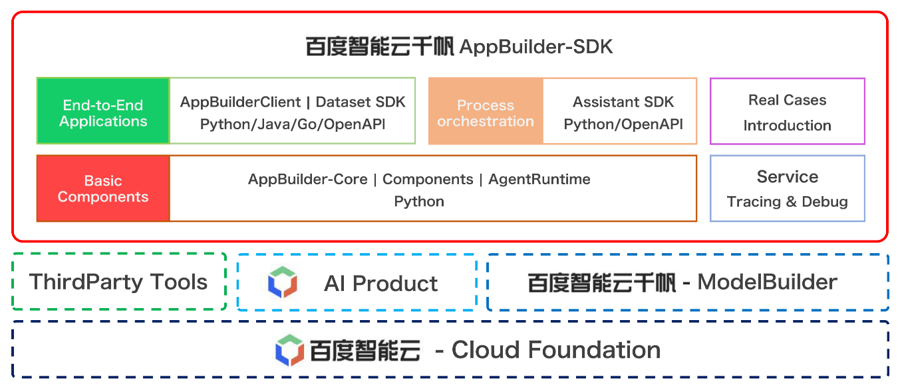

<div align="center">

<br>

[](LICENSE)


</div>

[简体中文](../README.md) | English | [日本語](./README_ja.md)

<br>


## What is AppBuilder SDK?

Baidu AI Cloud Qianfan AppBuilder SDK is a `one-stop development tool` for AI native application developers which contributed by [Baidu AI Cloud Qianfan AppBuilder](https://appbuilder.cloud.baidu.com/).


Baidu AI Cloud Qianfan AppBuilder SDK provides the following essential functions for AI application developers:

Baidu AI Cloud Qianfan AppBuilder-SDK offers the following essential features for AI application developers:

1. Utilization

    - Utilize large language models, freely accessing your models on Baidu AI Cloud Qianfan Large Model Platform to develop and optimize prompts.

    - Integrate capability components, providing over 40 high-quality groups originating from Baidu's ecosystem to empower Agent applications.

    - Integrate AI-native applications, accessing and managing AI-native applications published on [Baidu AI Cloud Qianfan AppBuilder Platform]((https://console.bce.baidu.com/ai_apaas/app)) through AppBuilderClient, and registering local functions to link end-cloud components.

2. Orchestration

    - Orchestrate and manage knowledge flows, managing knowledge bases through KnowledgeBase, performing create, read, update, and delete (CRUD) operations on documents and knowledge slices, and developing industry-grade RAG applications with Baidu AI Cloud Qianfan AppBuilder Platform.

    - Orchestrate and automate workflows, providing multi-level workflow abstractions such as `Message`, `Component`, and `AgentRuntime` to achieve workflow orchestration and integration with industry ecosystem capabilities like LangChain and OpenAI.

3. Monitoring
    -  Providing monitoring tools such as visual Tracing and detailed DebugLog to assist developers in production environments.

4. Deployment

    - AgentRuntime supports deployment as an API service based on Flask and Gunicorn.
    - AgentRuntime supports deployment as a Chainlit-based dialog interaction front-end application.
    - Offering the appbuilder_bce_deploy tool for rapid deployment of programs to Baidu Cloud, providing public network API services, and enabling integration with AppBuilder's workflow functionalities.


##  How to install？

#### The latest version of Baidu AI Cloud Qianfan AppBuilder SDK is 0.9.4 (2024-09-10)

Baidu AI Cloud Qianfan AppBuilder SDK ReleaseNote please refer to our [version description](/docs/quick_start/changelog.md)

- We recommend installing the latest stable version of `Python`

```bash
python3 -m pip install --upgrade appbuilder-sdk
```
- For installation of `Java` and `Go` versions, as well as using `Docker` images, please refer to the [Installation Instructions](/docs/quick_start/install.md)


## Quickly start your first AI native application!

- Please install `appbuilder sdk` in a Python environment with `>=3.9` and use this end-to-end application example
- The example provides a trial token, but access and QPS are restricted. Please replace it with your personal token for official use

### 1. Large Language models
- The `Playground` component can be freely called. You can customize the `prompt` template and model parameters for any model you have permission on the Baidu AI Cloud Qianfan model platform

#### Code example

```python
import appbuilder
import os

# 设置环境中的TOKEN，以下TOKEN为访问和QPS受限的试用TOKEN，正式使用请替换为您的个人TOKEN
os.environ["APPBUILDER_TOKEN"] = "bce-v3/ALTAK-n5AYUIUJMarF7F7iFXVeK/1bf65eed7c8c7efef9b11388524fa1087f90ea58"

# 定义prompt模板
template_str = "你扮演{role}, 请回答我的问题。\n\n问题：{question}。\n\n回答："

# 定义输入，调用playground组件
input = appbuilder.Message({"role": "java工程师", "question": "请简要回答java语言的内存回收机制是什么，要求100字以内"})

playground = appbuilder.Playground(prompt_template=template_str, model="ERNIE Speed-AppBuilder")

# 以打字机的方式，流式展示大模型回答内容
output = playground(input, stream=True, temperature=1e-10)
for stream_message in output.content:
    print(stream_message)

# 流式输出结束后，可再次打印完整的大模型对话结果，除回答内容外，还包括token的用量情况
print(output.model_dump_json(indent=4))

```
#### Answer display

```shell
Java语言的
内存回收机制是通过垃圾回收器（Garbage Collector）来实现的。
垃圾回收器会自动检测不再使用的对象，并释放其占用的内存空间，从而确保系统的内存不会被耗尽。
Java提供了多种垃圾回收器，如串行回收器、并行回收器、CMS回收器和G1回收器等，以满足不同场景下的性能需求
。

{
    "content": "Java语言的内存回收机制是通过垃圾回收器（Garbage Collector）来实现的。垃圾回收器会自动检测不再使用的对象，并释放其占用的内存空间，从而确保系统的内存不会被耗尽。Java提供了多种垃圾回收器，如串行回收器、并行回收器、CMS回收器和G1回收器等，以满足不同场景下的性能需求。",
    "name": "msg",
    "mtype": "dict",
    "id": "2bbee989-40e3-45e4-9802-e144cdc829a9",
    "extra": {},
    "token_usage": {
        "prompt_tokens": 35,
        "completion_tokens": 70,
        "total_tokens": 105
    }
}
```

### 2. Component
- The SDK provides over 40 high-quality components sourced from the Baidu ecosystem, as listed in [Component List](https://cloud.baidu.com/doc/AppBuilder/s/Glqb6dfiz#3%E3%80%81%E5%BC%80%E9%80%9A%E7%BB%84%E4%BB%B6%E6%9C%8D%E5%8A%A1), Before calling, you need to apply for a [free trial quota](https://console.bce.baidu.com/ai/#/ai/apaas/overview/resource/getFree)
- The component in the example is the `RAG with Baidu Search Pro`, which combines Baidu Search's search engine technology with the semantic understanding ability of ERNIE model to more accurately understand the user's search intention and provide search results with higher relevance to the search query

#### Code Example
```python
import appbuilder
import os

# 设置环境中的TOKEN，以下TOKEN为访问和QPS受限的试用TOKEN，正式使用请替换为您的个人TOKEN
os.environ["APPBUILDER_TOKEN"] = "bce-v3/ALTAK-n5AYUIUJMarF7F7iFXVeK/1bf65eed7c8c7efef9b11388524fa1087f90ea58"

rag_with_baidu_search_pro = appbuilder.RagWithBaiduSearchPro(model="ERNIE Speed-AppBuilder")

input = appbuilder.Message("9.11和9.8哪个大")
result = rag_with_baidu_search_pro.run(
    message=input,
    instruction=appbuilder.Message("你是专业知识助手"))

# 输出运行结果
print(result.model_dump_json(indent=4))
```

#### Answer display
```
{
    "content": "9.11小于9.8。在比较两个小数的大小时，需要逐位比较它们的数值，包括整数部分和小数部分。对于9.11和9.8，整数部分都是9，所以需要在小数部分进行比较。小数点后的第一位是1和8，显然1小于8，所以9.11小于9.8。",
    "name": "msg",
    "mtype": "dict",
    "id": "eb31b7de-dd6a-485f-adb9-1f7921a6f4bf",
    "extra": {
        "search_baidu": [
            {
                "content": "大模型‘智商’受质疑:9.11 vs 9...",
                "icon": "https://appbuilder.bj.bcebos.com/baidu-search-rag-pro/icon/souhu.ico",
                "url": "https://m.sohu.com/a/793754123_121924584/",
                "ref_id": "2",
                "site_name": "搜狐网",
                "title": "大模型‘智商’受质疑:9.11 vs 9.8的比较揭示AI理解能力的..."
            },
            {
                "content": "究竟|9.11比9.8大?大模型们为何会...",
                "icon": "https://appbuilder.bj.bcebos.com/baidu-search-rag-pro/icon/tencent.svg.png",
                "url": "https://new.qq.com/rain/a/20240717A07JLV00",
                "ref_id": "4",
                "site_name": "腾讯网",
                "title": "究竟|9.11比9.8大?大模型们为何会在小学数学题上集体..."
            },
            ...
        ]
    },
    "token_usage": {
        "completion_tokens": 77,
        "prompt_tokens": 2008,
        "total_tokens": 2085
    }
}
```


### 3. AI-native applications
- The application in the example is: [Rap Mentor](https://appbuilder.baidu.com/s/3qfjXy7k)，Click on this link to try it out on the web page

#### Code Example

```python
import appbuilder
import os

# 设置环境中的TOKEN，以下TOKEN为访问和QPS受限的试用TOKEN，正式使用请替换为您的个人TOKEN
os.environ["APPBUILDER_TOKEN"] = "bce-v3/ALTAK-n5AYUIUJMarF7F7iFXVeK/1bf65eed7c8c7efef9b11388524fa1087f90ea58"

# 从AppBuilder网页获取并传入应用ID，以下为说唱导师应用ID
app_id = "4678492a-5864-472e-810a-654538d3503c"

app_builder_client = appbuilder.AppBuilderClient(app_id)
conversation_id = app_builder_client.create_conversation()

answer = app_builder_client.run(conversation_id, "以“上班狼狈却又追逐梦想“为主题进行一首说唱创作，保持押韵, 控制在200字以内")
print(answer.content.answer)
```

#### Answer display
```shell
好的，我们来以“上班狼狈却又追逐梦想”为主题，进行一段简短的说唱创作。这里是一个简单的示例，你可以根据自己的感觉进行调整：

Intro:
朝九晚五，生活重压，
狼狈上班，却心怀梦想，
每一天，都是新的挑战，
为了那未来，我奋发向前。

Verse 1:
穿上西装，打好领带，
步入人群，去追逐名利，
虽然狼狈，却不曾言败，
因为心中，有梦想在激励。

Hook:
上班狼狈，却不曾放弃，
追逐梦想，是我心中的火炬，
照亮前路，指引我前行，
无论多难，我都要坚持到底。

这首小曲儿以“上班狼狈却又追逐梦想”为主题，通过押韵的方式表达了上班族虽然生活艰辛，但依然怀揣梦想，勇往直前的精神。希望你喜欢！
```

**For more examples of AI native application code, please refer to [CookBooks](./bookbooks/README.md)**. We have the following cookbooks that we recommend you to read first:
- Basic Ability Components
    - [General Text Recognition Component](/cookbooks/components/general_ocr.ipynb)
    - [Basic component service-oriented deployment](/cookbooks/components/agent_runtime.ipynb)
- Process orchestration
    - [Assistant SDK](/cookbooks/pipeline/assistant_function_call.ipynb)
- End-to-end applications
    - [Agent](/cookbooks/agent_builder.ipynb)
    - [RAG](/cookbooks/end2end_application/rag/rag.ipynb)
    - [Enterprise level Q&A system](/cookbooks/end2end_application/rag/qa_system_2_dialogue.ipynb)
- Advaned Practice
    - [Deploying services on public cloud](/cookbooks/advanced_application/cloud_deploy.ipynb)
    - [Service Tracing](/cookbooks/appbuilder_trace/trace.ipynb)


## Panorama of Baidu AI Cloud Qianfan AppBuilder SDK capability
<div align="center">

</div>


## User Documentation

- [Quick start](/docs/quick_start/README.md)
    - [Installation instructions](/docs/quick_start/install.md)
    - [Release note](/docs/quick_start/changelog.md)
- [Basic components](/docs/basic_module/README.md)
    - [Basic Ability Components](/docs/basic_module/components.md)
    - [Process orchestration](/docs/basic_module/assistant_sdk.md)
    - [End-to-end applications](/docs/basic_module/appbuilder_client.md)
- [Advanced Practice](/docs/advanced_application/README.md)
    - [Cookbooks](/cookbooks/README.md)
- [Service deployment](/docs/service/README.md)
    - [API calls](/docs/service/flask.md)
    - [Interactive front-end](/docs/service/chainlit.md)
    - [Cloud deployment](/docs/service/cloud.md)
- [Secondary development](/docs/develop_guide/README.md)


## Open source community and activities
<div align="center">
<h3>AppBuilder-SDK WeChat Group QR Code</h3>

</div>

- [Github Issue](https://github.com/baidubce/app-builder/issues):  Submit installation/usage issues, report bugs, suggest new features, communicate development plans, etc

- [Baidu AI Cloud Qianfan Community](https://cloud.baidu.com/qianfandev)


## License

AppBuilder SDK follows the Apache 2.0 open source protocol.

