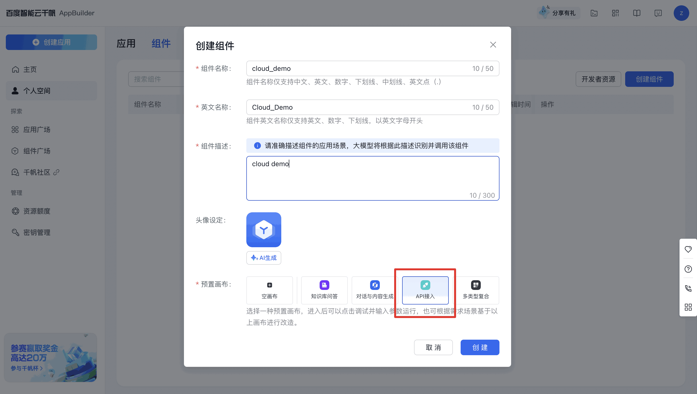
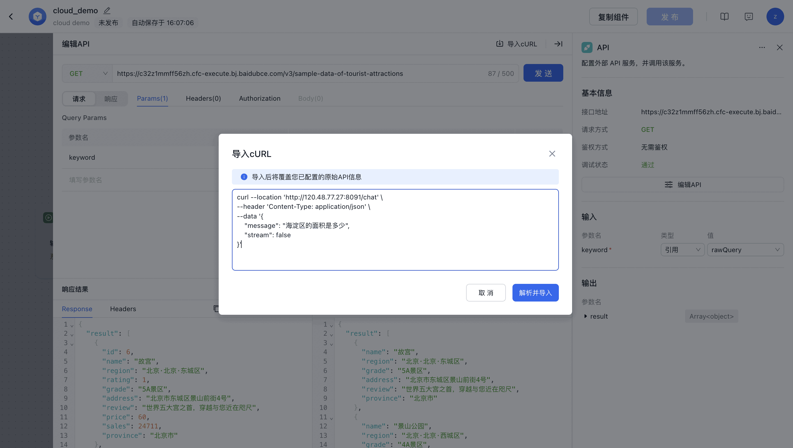
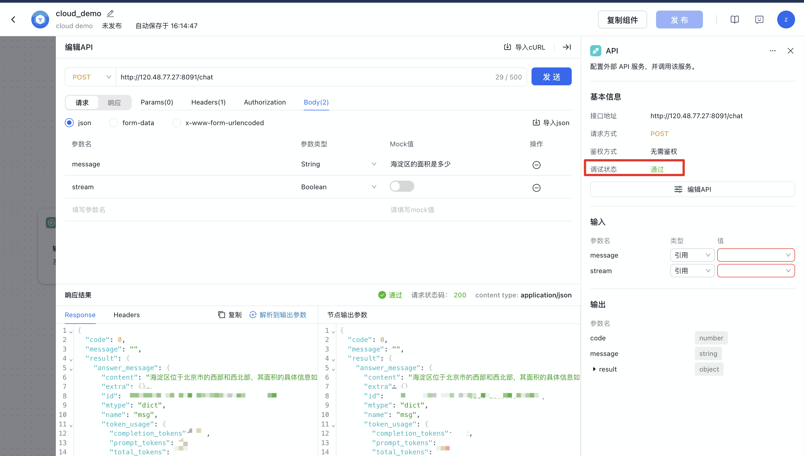

# 公有云部署
**注意⚠️：部署上云功能目前处于内测阶段，使用过程中有任何问题，欢迎提issue或微信群反馈～**
支持一键将自己的服务部署到公有云上，目前支持百度智能云。部署后可以自动生成公网ip，无需额外配置。可以用来解决以下问题：
* 在百度云部署的WebService，可以引入到AppBuilder工作流中的API节点，形成应用中嵌套应用，构建能够解决复杂业务问题的工作流。
* 可将自己本地复杂的服务、组件、模型等，方便快捷地上云，并与AppBuilder形成联动。
* etc.


### 前置操作:
* 在百度智能云完成实名认证，并开通bos服务：
  * https://cloud.baidu.com/doc/BOS/s/Jk4xttg03#%E5%BC%80%E9%80%9Abos%E6%9C%8D%E5%8A%A1
* 您需要在钱包中至少充值100元，用于bcc服务、bos服务费用
  * 云服务费用标准：https://cloud.baidu.com/product-price/bcc.html
  * 默认配置使用最便宜的bcc.e1.c2m2，并且使用按量付费
  * bos存储服务费用标准：https://cloud.baidu.com/product-price/bos.html
* 通过如下步骤获得您的AK/SK信息：
  * https://cloud.baidu.com/doc/Reference/s/9jwvz2egb

### 部署流程：
* 以下面的yaml文件为模板创建config.yaml，完善配置文件
  * 最小修改范围：ak、sk、admin_pass、run_cmd、local_dir、APPBUILDER_TOKEN
```yaml
bce_config:
    host: "http://bcc.bj.baidubce.com"
    bos_host: "bj.bcebos.com"
    # 前置操作获取的ak、sk
    ak: ""
    sk: ""
    spec: "bcc.e1.c2m2"
    root_disk_size_in_gb: 20
    # 服务器密码，根据实际使用设置
    admin_pass: ""
    security_group_id: ""
    zone_name: cn-bj-d

appbuilder_config:
    # 本地用来打包的代码路径，根据实际使用修改
    local_dir: "./sample"
    workspace: "/home/work/appbuilder"

    # 服务的运行命令，根据实际使用修改
    run_cmd: "python3 component_sample.py"

env:
    APPBUILDER_LOGLEVEL: debug
    APPBUILDER_TOKEN: ""
```

* 编写自己的服务运行代码（以组件服务为例）
```bash
mkdir sample
touch sample/component_sample.py
# 编辑sample/component_sample.py，写入下面的python代码
```
```python
# ./smaple目录下component_sample.py
import appbuilder

component = appbuilder.Playground(prompt_template="{query}", model="ERNIE-Bot")
agent = appbuilder.AgentRuntime(component=component)
agent.serve(port=8091)
```

* 执行部署
```bash
# config.yaml为上面创建的配置文件
appbuilder_bce_deploy --conf ./config.yaml
```

### 请求示例：
* 取日志 “deployment finished! public ip:”后的ip
* 稍等两到三分钟，服务启动后即可访问
``` bash
# public_ip为上一步取到的ip
curl --location 'http://{public_ip}:8091/chat' \
--header 'Content-Type: application/json' \
--data '{
    "message": "海淀区的面积是多少",
    "stream": false
}'
```
* 返回结果
```json
{
  "code": 0,
  "message": "",
  "result": {
    "answer_message": {
      "content": "海淀区位于北京市的西部和西北部，其面积的具体数据在不同来源中略有差异。根据参考文章，可以归纳出以下信息：\n\n* 海淀区的面积约为**431平方千米**（来源于参考文章1）。\n* 另一数据为**430.8平方公里**（来源于参考文章2）。\n* 首都之窗_北京市人民政府门户网站的数据为**430.77平方公里**（来源于参考文章3）。\n* 海淀区台办的数据也提到其面积为**430.8平方公里**（来源于参考文章4）。\n\n综上所述，海淀区的面积大致在**430.77至431平方千米**之间。这些细微的差异可能是由于测量方法和时间的不同导致的。在大多数情况下，可以认为海淀区的面积是约431平方千米。",
      "extra": {},
      ...
    },
    "session_id": "xxx"
  }
}
```
  * 若返回结果不符合预期，使用自己的"admin_pass"登陆服务器进行调试，具体参考文档：https://cloud.baidu.com/doc/BCC/s/Hkbblll70

### 接入AppBuilder工作流示例：
* 进入AppBuilder官网，先后点击“个人空间”、“组件”、“创建组件”、“API接入”


* 点击“编辑API”、“导入cURL”，粘贴上面的curl命令，解析并导入


* 调试通过
